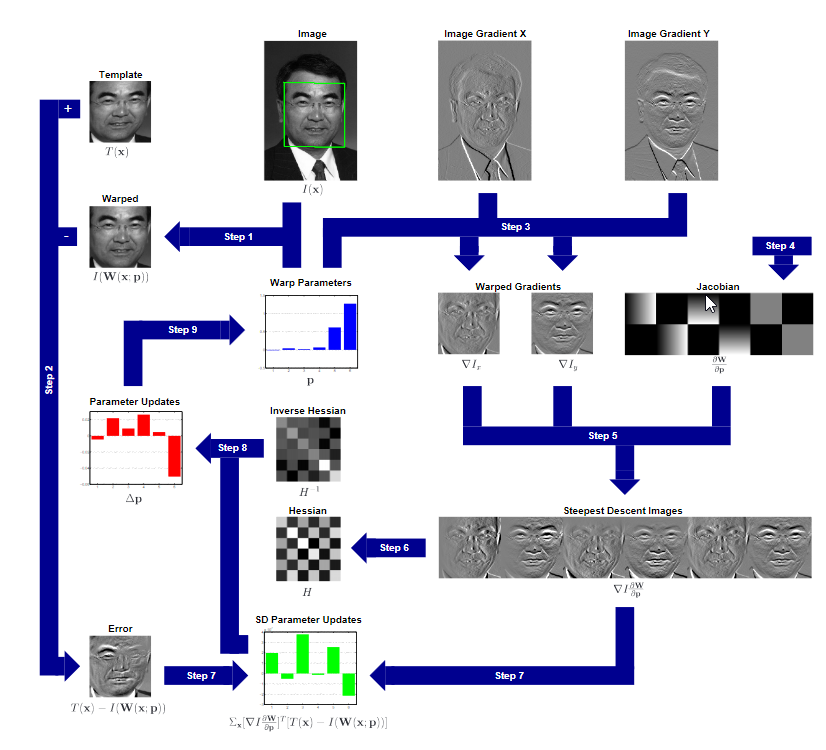

# Lucas_Kanade_Template_Tracker

A schematic overview of the Lucas-Kanade algorithm. The image I is
warped with the current estimate of the warp in Step 1 and the result
subtracted from the template in Step 2 to yield the error image. The
gradient of I is warped in Step 3, the Jacobian is computed in Step 4,
and the two combined in Step 5 to give the steepest descent images. In
Step 6 the Hessian is computed from the steepest descent images. In Step
7 the steepest descent parameter updates are computed by dot producting
the error image with the steepest descent images. In Step 8 the Hessian
is inverted and multiplied by the steepest descent parameter updates to
get the final parameter updates p which are then added to the
parameters p in Step 9.

## Algorithm

